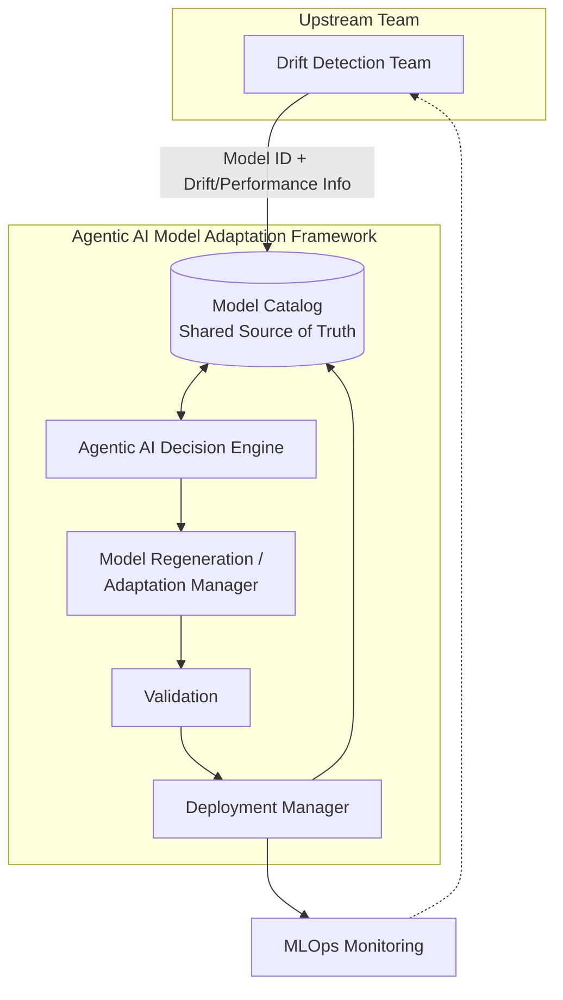
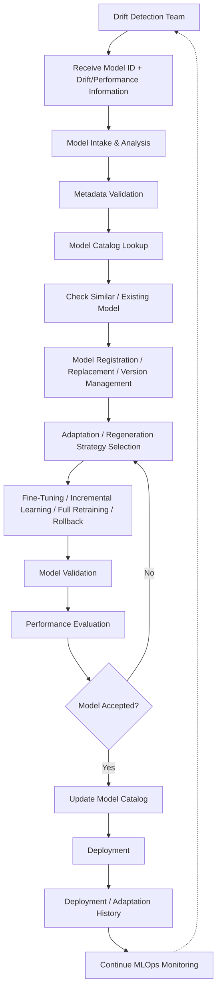
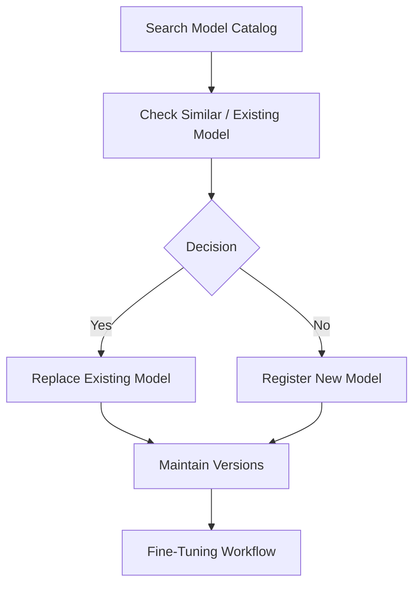
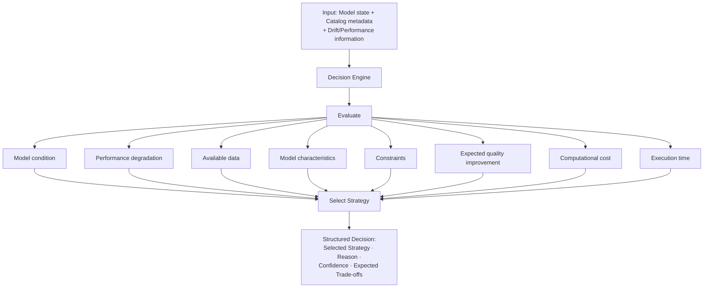

# Agentic AI Model Adaptation Framework for O-RAN

> An intelligent MLOps framework for autonomous AI model adaptation, regeneration, validation, and lifecycle management in O-RAN / AI-RAN environments.


---

## Table of Contents

1. [Overview](#overview)
2. [Problem Statement](#problem-statement)
3. [Objectives](#objectives)
4. [Key Features](#key-features)
5. [System Architecture](#system-architecture)
6. [End-to-End Workflow](#end-to-end-workflow)
7. [Model Lifecycle](#ai-model-lifecycle)
8. [Model Catalog](#model-catalog)
9. [Agentic AI Decision Engine](#agentic-ai-decision-engine)
10. [Model Adaptation & Regeneration](#model-adaptation--regeneration)
11. [MLKTL Scenario Selection](#mlktl-scenario-selection)
12. [Deployment Manager](#deployment-manager)
13. [Technology Stack](#technology-stack)
14. [Proposed Repository Structure](#proposed-repository-structure)
15. [Team Contributions](#team-contributions)
16. [Experimental Evaluation](#experimental-evaluation)
17. [Testing](#testing)
18. [API Design](#api-design)
19. [Installation](#installation)
20. [Usage](#usage)
21. [12-Week Roadmap](#12-week-roadmap)
22. [Research Contribution](#research-contribution)
23. [Limitations](#limitations)
24. [Future Work](#future-work)
25. [Research References](#research-references)
26. [Team](#team)
27. [License](#license)

---

## Overview

This repository contains the design and implementation of an **Agentic AI Model Adaptation Framework** targeted at O-RAN / AI-RAN environments. AI/ML models deployed in radio access network functions are subject to continuous data drift, changing traffic patterns, and evolving operating conditions, which degrade model performance over time. This project proposes a unified, agent-driven framework that receives drift and performance signals from an upstream drift detection workflow, evaluates the current state of a model against a centralized Model Catalog, and autonomously selects and executes an appropriate adaptation strategy — Fine-Tuning, Incremental Learning, Full Retraining, or Rollback.

The framework is designed to close the loop between drift detection and model redeployment, maintaining a consistent, auditable record of model metadata, versions, and adaptation history across the lifecycle.

## Problem Statement

Deployed AI/ML models in network environments degrade due to:

- Data drift
- Changing usage patterns
- Changing operating conditions
- Performance degradation over time
- Evolving requirements

Model regeneration and adaptation decisions are often manual and inconsistent. Multiple candidate strategies exist — Fine-Tuning, Incremental Learning, Full Retraining, and Rollback — but there is no unified mechanism to evaluate the current model state and select an appropriate strategy. In addition, model metadata, versions, capabilities, constraints, performance metrics, deployment history, and regeneration history tend to become fragmented across disconnected systems.

This project proposes a centralized Model Catalog combined with an intelligent, agentic decision-making layer to address this gap, forming an end-to-end model adaptation lifecycle for O-RAN / AI-RAN environments.

## Objectives

- Design a centralized Model Catalog as the shared source of truth for model metadata, versions, and history.
- Design an Agentic AI Decision Engine capable of autonomously selecting an adaptation strategy based on model and drift/performance state.
- Provide a standardized execution interface for Fine-Tuning, Incremental Learning, Full Retraining, and Rollback strategies.
- Provide a Deployment Manager that supports deployment, rollback, and history recording.
- Evaluate and compare adaptation strategies under a consistent experimental protocol.
- Apply the framework conceptually to O-RAN / AI-RAN model lifecycle management.

## Key Features

- Centralized Model Catalog for metadata, versioning, capabilities, constraints, performance, deployment, and regeneration history.
- Duplicate / similar-model detection with registration and replacement workflows.
- Agentic decision-making layer for autonomous adaptation strategy selection with justification and confidence scoring.
- Standardized execution interface across four adaptation strategies.
- Deployment and rollback support with history tracking.
- Designed for integration with an upstream drift detection workflow.

> The framework is designed to support the capabilities above. Implementation status for each component is described in the relevant sections below.

## System Architecture

### Architecture Overview

The framework begins its workflow after receiving a Model ID and associated drift/performance information from an upstream **Drift Detection Team**. This project does not perform the initial drift detection; that information is treated as an input contract, described below.

**Inputs received from the Drift Detection Team:**

- Drift detected / not detected
- Drift type
- Drift severity
- Model performance metrics
- Network telemetry
- Network logs
- Model ID
- Model information / metadata

**Outputs provided by this framework:**

- Selected model adaptation strategy
- Updated AI model
- Validation results
- Deployment recommendation
- Adaptation log

### Core Components

The framework consists of four major components:



1. **Agentic AI Decision Engine** — evaluates model state and selects an adaptation strategy.
2. **Model Catalog** — centralized store of model metadata, versions, capabilities, constraints, and history.
3. **Model Regeneration / Adaptation Manager** — executes the selected strategy through a standardized interface.
4. **Deployment Manager** — deploys adapted models and records deployment/rollback history.

Each component is described in detail in the sections below.

## End-to-End Workflow



## AI Model Lifecycle

The framework conceptualizes the model lifecycle in thirteen stages:

1. Model Intake
2. Metadata Validation
3. Catalog Lookup
4. Model Registration / Replacement
5. Version Management
6. Drift/Performance Evaluation Input
7. Strategy Selection
8. Adaptation / Regeneration
9. Validation
10. Catalog Update
11. Deployment
12. Monitoring
13. Future Adaptation Cycle

```mermaid
flowchart LR
    A[Model Intake] --> B[Metadata Validation]
    B --> C[Catalog Lookup]
    C --> D[Registration / Replacement]
    D --> E[Version Management]
    E --> F[Drift/Performance<br/>Evaluation Input]
    F --> G[Strategy Selection]
    G --> H[Adaptation / Regeneration]
    H --> I[Validation]
    I --> J[Catalog Update]
    J --> K[Deployment]
    K --> L[Monitoring]
    L --> M[Future Adaptation Cycle]
    M -.-> F
```



## Model Catalog

### Catalog Responsibilities

The Model Catalog is the central, shared source of truth for the framework. It is designed to maintain:

- Model Metadata
- Model Versions
- Model Capabilities
- Model Constraints
- Performance Metrics
- Deployment History
- Regeneration History

A centralized catalog is important because model lifecycle management requires consistent version control, reproducibility, and auditability across every adaptation cycle. Without a single source of truth, rollback decisions, strategy selection, deployment history, and regeneration history become fragmented across systems, making it difficult to reconstruct the state of a model or justify an adaptation decision after the fact. The catalog is designed to serve as the shared reference that both the Decision Engine and Deployment Manager read from and write to.

### Catalog Data

| Category | Description |
|---|---|
| Model Metadata | Descriptive information identifying the model, its purpose, and its origin. |
| Model Version | Version identifiers tracking successive registrations, replacements, and adaptations of a model. |
| Capabilities | Functional characteristics describing what the model is designed to do. |
| Constraints | Operational or resource limitations relevant to deployment and adaptation decisions. |
| Performance Metrics | Recorded performance indicators used to evaluate model condition over time. |
| Deployment History | Record of prior deployments, including timing and outcomes. |
| Regeneration History | Record of prior adaptation/regeneration events and the strategies applied. |

### Model Catalog Manager Workflow



### Conceptual Schema

The following is a **conceptual** representation of a Model Catalog record. It is not the exact database schema unless explicitly implemented in the codebase.

```json
{
  "model_id": "string",
  "model_name": "string",
  "version": "string",
  "framework": "string",
  "model_type": "string",
  "capabilities": ["string"],
  "constraints": ["string"],
  "performance_metrics": {
    "metric_name": "value"
  },
  "deployment_history": [
    {
      "deployed_at": "timestamp",
      "status": "string"
    }
  ],
  "regeneration_history": [
    {
      "strategy": "string",
      "triggered_at": "timestamp",
      "outcome": "string"
    }
  ],
  "created_at": "timestamp",
  "updated_at": "timestamp"
}
```

> **Conceptual Model Catalog Schema** — subject to change during implementation.

## Agentic AI Decision Engine

The Decision Engine is designed as an autonomous reasoning layer that maps Model Catalog data, together with drift and performance information, to an adaptation/regeneration strategy. **LangGraph** is the planned orchestration/state-machine technology for this component.

> The system is described as an **agentic decision engine** implementing an **autonomous reasoning workflow**. It should not be characterized as using a large language model unless confirmed by the actual implementation.

**Responsibilities:**

- Read model state from the Model Catalog
- Analyze model condition
- Evaluate relevant model information
- Select an appropriate adaptation/regeneration strategy
- Produce a structured regeneration/adaptation decision
- Provide justification for the decision
- Provide expected trade-offs
- Use confidence scoring
- Coordinate the decision workflow

### Decision Process



Confidence scoring is used conceptually to express the Decision Engine's relative certainty in a selected strategy given the available catalog and drift information. No specific scoring formula is defined at this stage; confidence scoring will be defined during implementation.

## Model Adaptation & Regeneration

The **Model Regeneration / Adaptation Manager** provides a common execution interface for four supported strategies, allowing the Decision Engine to invoke each strategy in a standardized way regardless of its internal implementation.

**Responsibilities:**

- Strategy execution
- Progress tracking
- Resource usage monitoring
- Failure handling
- Timeout handling
- Recording regeneration results
- Updating the Model Catalog

| Strategy | Purpose | Data Requirement | Expected Use |
|---|---|---|---|
| Fine-Tuning | Adjust an existing model's parameters using a limited amount of new data to correct localized degradation. | Small, targeted dataset reflecting recent conditions. | Suitable when the base model remains largely valid but requires focused correction. |
| Incremental Learning | Update a model progressively as new data becomes available, without discarding previously learned knowledge. | Streaming or periodically arriving data. | Suitable for gradually evolving conditions where continuous adaptation is preferable to periodic retraining. |
| Full Retraining | Train a new model from scratch (or from a base checkpoint) using a comprehensive dataset. | Large, representative dataset covering current conditions. | Suitable when degradation is significant or the existing model is no longer representative of current conditions. |
| Rollback | Revert to a previously validated model version from the Model Catalog. | No new data required; relies on catalog version history. | Suitable when a recent adaptation has failed validation or introduced regressions. |

Strategy selection depends on model state, degradation pattern, data availability, cost, execution time, and expected quality improvement. No strategy is presented as universally superior; the appropriate choice depends on the specific adaptation context.

### Intelligent Adaptation Strategies

In addition to the four regeneration strategies above, the proposed architecture includes higher-level adaptation actions used within the intelligent model adaptation workflow:

- **Sync** — aligning the deployed model or its catalog record with the latest available state or metadata.
- **Recalibrate** — adjusting model behavior or parameters in response to observed condition changes.
- **Regenerate** — producing an updated model instance through one of the supported regeneration strategies.
- **Expand Scope** — extending a model's applicability to additional conditions, scenarios, or capabilities.

These are described as higher-level adaptation concepts within the workflow and are **not** presented as a fixed one-to-one mapping onto Fine-Tuning, Incremental Learning, or Full Retraining unless such a relationship is explicitly established by the implementation.

## MLKTL Scenario Selection

The fine-tuning workstream considers a set of MLKTL scenario categories when selecting how a model should be adapted:

- Consumer
- Source Triggered
- Peer Function
- Source Function

These are the supported MLKTL scenario categories used by the fine-tuning workstream. Detailed semantics for each category are implementation-specific and will be defined as the fine-tuning workflow is developed.

## Deployment Manager

**Responsibilities:**

- Deploy regenerated/adapted models
- Support deployment-related operations
- Support rollback
- Update Model Catalog after successful deployment
- Record deployment history
- Record refreshed performance metrics

**FastAPI** is the planned technology for deployment and rollback endpoints. Production deployment is not claimed at this stage; the Deployment Manager is described as a planned component of the framework.

## Technology Stack

| Technology | Purpose |
|---|---|
| Python | Core implementation language. |
| PyTorch | Fine-Tuning, Incremental Learning and Full Retraining. |
| TensorFlow | Alternative deep learning backend. |
| MLflow | Model metadata tracking, model versioning, regeneration/deployment history. |
| LangGraph | Agent orchestration/state machine. |
| FastAPI | Deployment and rollback endpoints. |
| Scikit-learn | Evaluation metrics such as accuracy, F1 and calibration. |
| NumPy | Numerical computation. |
| Pandas | Data handling and result analysis. |
| Matplotlib | Result visualization. |
| Git | Version control. |
| GitHub | Repository hosting and team collaboration. |

## Proposed Repository Structure

> The structure below is a **proposed** organization for the repository. It does not represent files that currently exist unless implemented.

```
agentic-ai-model-adaptation-oran/
│
├── README.md
├── LICENSE
├── .gitignore
├── requirements.txt
├── pyproject.toml
│
├── src/
│   ├── decision_engine/
│   ├── model_catalog/
│   ├── model_regeneration/
│   ├── deployment/
│   ├── validation/
│   └── common/
│
├── models/
├── datasets/
├── experiments/
│
├── tests/
│   ├── unit/
│   ├── integration/
│   └── workflow/
│
├── configs/
├── scripts/
│
├── docs/
│   ├── architecture/
│   ├── workflows/
│   ├── research/
│   └── diagrams/
│
└── results/
```

## Team Contributions

| Member | Role | Key Responsibilities |
|---|---|---|
| Tamilselvan R | Model Intake & Analysis | Receives the Model ID and accompanying information; analyzes model structure, purpose, and dependencies; validates model metadata for completeness and correctness; forwards the validated model to the Model Catalog Manager. |
| Nitesh N D | Model Catalog Manager | Searches the Model Catalog for the incoming model; checks whether a similar/existing model is already registered; replaces the existing model entry if a match is found, or registers a new model when required; maintains model versions; forwards the catalog entry toward the fine-tuning workflow. |
| Ramanujam P | MLKTL Scenario & Fine-Tuning Engineer | Selects the MLKTL scenario (Consumer, Source Triggered, Peer Function, Source Function); performs fine-tuning / transfer learning; checks whether the desired accuracy is achieved; sends the model toward deployment when successful, or escalates to the retraining workflow when required. |
| Bhuvaneshwar T S | Retraining & Catalog Update Engineer | Checks whether retraining is feasible; retrains the model when feasible; updates the Model Catalog with retrained model details; sends the final model toward deployment, or routes to the operator for manual review when retraining is not feasible. |

## Experimental Evaluation

The project plans to evaluate adaptation strategies using the following metrics:

- Accuracy
- F1 Score
- Accuracy Delta
- Execution Time
- Memory Usage
- CPU/GPU Overhead
- Computational Cost
- Rollback Safety
- Decision Accuracy

The evaluation is designed to compare **Fine-Tuning**, **Incremental Learning**, **Full Retraining**, and **Rollback** where applicable, considering the same degraded model instance where possible. The project also plans to evaluate how consistently the Decision Engine's automated strategy selection agrees with the strategy that performs best in hindsight.

Scalability will be studied by varying:

- Model size
- Frequency of regeneration/adaptation triggers

**Experimental results will be added after evaluation.**

## Testing

### Unit Testing
Test individual modules in isolation.

### Integration Testing
Test communication between the Model Catalog, Decision Engine, Regeneration Manager, and Deployment Manager.

### Workflow Testing
Test the complete end-to-end adaptation workflow, from model intake through deployment.

### Model Validation Testing
Check model quality after adaptation before it is accepted into the catalog.

### Rollback Testing
Verify rollback behavior against previously catalogued model versions.

### Catalog Consistency Testing
Verify that model versions and history remain consistent after registration, replacement, and adaptation events.

### Failure / Timeout Testing
Verify correct handling of failed or timed-out regeneration operations.

> Test results are not reported here. This section describes the planned testing scope; results will be added once test execution is complete.

## API Design

> The endpoints below are a **Proposed API Design** and are not presented as implemented endpoints.

```
POST   /models
GET    /models/{model_id}
GET    /models/{model_id}/versions
POST   /adaptation/decision
POST   /adaptation/execute
POST   /deployment
POST   /rollback
```

## Installation

```bash
git clone <repository-url>
cd agentic-ai-model-adaptation-oran

python -m venv .venv
```

Activate the virtual environment:

**Windows:**
```bash
.venv\Scripts\activate
```

**Linux/macOS:**
```bash
source .venv/bin/activate
```

Install dependencies:

```bash
pip install -r requirements.txt
```

## Usage

The following describes the conceptual usage workflow of the framework. Actual CLI commands are not yet finalized and the steps below are pseudocode.

```text
1. Receive model/drift information
2. Validate model metadata
3. Query Model Catalog
4. Check similar/existing model
5. Maintain model version
6. Select adaptation strategy
7. Execute adaptation/regeneration
8. Validate updated model
9. Update Model Catalog
10. Deploy
11. Record deployment history
```

## 12-Week Roadmap

### Month 1 — Research & System Design

| Week | Focus |
|---|---|
| Week 1 | Literature survey on autonomous model lifecycle management, Agentic AI, Model Catalog design, model regeneration strategies, and MLOps/ModelOps; comparison of recent research papers. |
| Week 2 | Comparison of Fine-Tuning, Incremental Learning, Full Retraining, and Rollback in terms of cost, data requirements, and expected quality gain; definition of evaluation metrics; selection of experimental model/dataset; draft evaluation protocol. |
| Week 3 | Design of the complete system architecture; definition of the four modules, their responsibilities, and inputs/outputs; design of data contracts, the Model Catalog schema, the Agentic AI Decision Engine, and the end-to-end workflow. |
| Week 4 | Identification of limitations in existing approaches; finalization of the problem statement, objectives, and success criteria; literature survey report and paper comparison matrix. |

### Month 2 — Framework Development

| Week | Focus |
|---|---|
| Week 5 | Development of the Model Catalog: metadata, versions, capabilities, constraints, performance metrics, deployment history, regeneration history, and catalog query interface. |
| Week 6 | Development of the Agentic AI Decision Engine: strategy selection, rule-based reasoning with confidence scoring, autonomous reasoning workflow, integration with the Model Catalog. |
| Week 7 | Development of the Model Regeneration Manager: Fine-Tuning, Incremental Learning, Full Retraining, and Rollback implementations, with execution monitoring and failure/timeout handling. |
| Week 8 | Development of the Deployment Manager: deployment workflow, Model Catalog updates, deployment history, performance metric updates; integration of all four modules; end-to-end smoke test. |

### Month 3 — Evaluation, Documentation & Presentation

| Week | Focus |
|---|---|
| Week 9 | Functional, unit, integration, workflow, and rollback testing. |
| Week 10 | Evaluation of all four strategies across accuracy, F1, execution time, memory usage, CPU/GPU overhead, decision accuracy, and scalability. |
| Week 11 | Result analysis, comparison graphs, finalized architecture diagrams, draft IEEE paper sections, presentation preparation. |
| Week 12 | Framework optimization, final validation, final documentation, complete IEEE paper, final presentation and demonstration. |

## Research Contribution

The project investigates a unified approach to autonomous AI model adaptation for network environments. Possible contributions of this work include:

- A centralized Model Catalog for AI lifecycle management.
- An autonomous strategy selection mechanism.
- An agentic decision-making approach to model adaptation.
- Support for multiple regeneration strategies under a common execution interface.
- Model version and lifecycle history tracking.
- Automated validation of adapted models.
- Deployment and rollback integration.
- Comparative evaluation of adaptation strategies.
- Application of the framework concepts to O-RAN / AI-RAN environments.

The framework proposes to evaluate these contributions empirically as implementation progresses; no claims of novelty relative to prior work are made beyond what is supported by the research references cited in this document.

## Limitations

- Experimental results depend on the selected models and datasets used during evaluation.
- Strategy selection quality depends on the completeness and accuracy of available model metadata.
- O-RAN deployment integration may require additional infrastructure beyond the scope of this repository.
- Real-world, network-scale validation may require larger test environments than are currently available.
- Exact MLKTL scenario behavior depends on the underlying fine-tuning implementation.
- Production-grade automation would require additional security and reliability controls not currently in scope.

## Future Work

- More advanced strategy selection policies.
- Additional adaptation strategies beyond the four currently supported.
- More sophisticated model similarity and search mechanisms.
- Resource-aware decision-making in the Decision Engine.
- Larger-scale O-RAN / AI-RAN experiments.
- More comprehensive benchmarking across models and datasets.
- Production-grade deployment support.
- Advanced validation mechanisms for adapted models.
- Improved autonomous lifecycle management.
- More extensive real-world telemetry integration.

## Research References

1. D. Kreuzberger, N. Kühl, and S. Hirschl, "Machine Learning Operations (MLOps): Overview, Definition, and Architecture," *IEEE Access*, vol. 11, pp. 31866–31879, 2023.
2. G. Mallardi, F. Calefato, L. Quaranta, and F. Lanubile, "An MLOps Approach for Deploying Machine Learning Models in Healthcare Systems," IEEE Conference, 2024.
3. C. Zhao, R. Zhang, J. Wang, D. Niyato, G. Sun, X. Wang, S. Mao, and A. Jamalipour, "From Agentification to Self-Evolving Agentic AI for Wireless Networks: Concepts, Approaches, and Future Research Directions," arXiv preprint arXiv:2510.05596, 2025.
4. R. S. Babu and A. Agrawal, "Self-Healing Agentic Orchestrators for Reliable Tool-Augmented Large Language Model Systems," arXiv preprint arXiv:2606.01416, 2026.
5. Y. Shan et al., "AIOpsLab: A Holistic Framework to Evaluate AI Agents for Enabling Autonomous Clouds," arXiv preprint arXiv:2501.06706, 2025.
6. "Trustworthy Self-Composable Big-Data-as-a-Service: An LLM-Orchestrated Multi-Agent Framework for Automated Data Engineering, AutoML, MLOps Deployment, and Drift-Aware Lifecycle Optimization," arXiv preprint arXiv:2606.17915, 2026.
7. A. Damaraju, V. Kolluri, S. Jangampeta, N. K. Ale, Y. D. Seetharama, A. Joshi, and D. Seenivasan, "Self-Healing AI Model Infrastructure: An Automated Approach to Model Deployment Maintenance and Reliability," International Journal of Information Technology and Management Information Systems, 2025.
8. T. Rausch, W. Hummer, V. Muthusamy, A. Rashed, and P. Dube, "ModelOps: Cloud-Based Lifecycle Management for Reliable and Trusted AI," IEEE International Conference on Cloud Engineering (IC2E), 2019.

## Team

| Member | Role |
|---|---|
| Tamilselvan R | Model Intake & Analysis |
| Nitesh N D | Model Catalog Manager |
| Ramanujam P | MLKTL Scenario & Fine-Tuning Engineer |
| Bhuvaneshwar T S | Retraining & Catalog Update Engineer |

## License

This project is licensed under the [MIT License](LICENSE).
